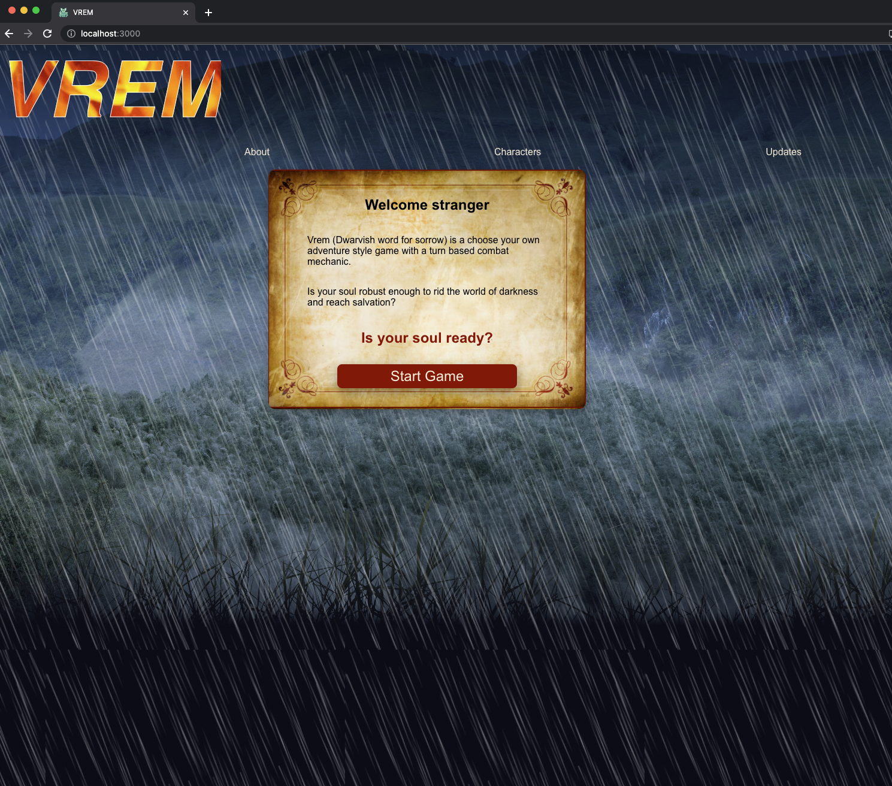

# CodeClan Final Project - VREM

* [Introduction](#introduction)
* [How to Run](#howtorun)

## Introduction

VREM (Dwarvish word for sorrow) is a choose your own adventure game implementing a React front end and a Spring Boot back end for data persistence. This was was a solo build capstone project over a two week period, concluding CodeClan's Professional Software Development course.  The game allows players to select various characters who are given random health values and starting equipment upon creatiion. Once created, they are to follow a narritve which they decide on how to proceed through. However, some decisions can lead to an early death so beware!

The current build is a prototype and is set up for demonstration purposes. 

The game story, CSS and features are currnently being developed to a smoother and well rounded experience.

Thank you for taking the time to view my project, I will include updates as an when they are shipped.

## How to Run
### Prerequisites
Please ensure you have the IDE Intellij IDEA CE installed on your machine to run the Spring Boot application.

### Executing the code
1. Clone the repo: from your terminal, run `git clone https://github.com/YatJam/VREM_Final_Project.git`
1. Go to the project directory: `cd VREM_Final_Project`
1. Using IntelliJ IDEA, open the folder Vrem_Spring and run the application from the IDE.
1. Return to the project directory and enter the vrem folder: `cd vrem`
1. To intitialise the React front end: `npm install`
1. To run the React front end application: `npm start`
    - A new page in your browser should automatically load with the VREM homepage.

### Terminate the applications
1. Stop the application in Intellij IDEA to close the database.
1. Use control + c in the terminal to close the React app.

## Homepage

