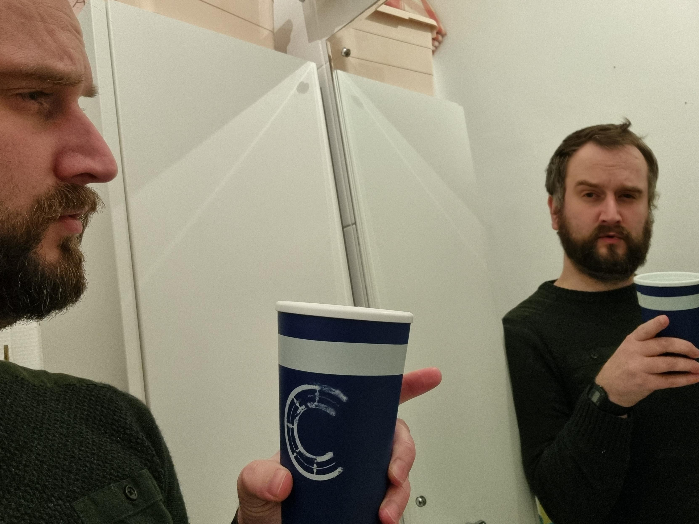

Final Project - VREM

* [Installation](#installation)

VREM (Dwarvish word for sorrow) is a choose your own adventure game implementing a React front end and a Spring Boot back end for data persistence. This was was a solo build capstone project over a two week period, concluding CodeClan's Professional Software Development course.  The game allows players to select various characters who are given random health values and starting equipment upon creatiion. Once created, they are to follow a narritve which they decide on how to proceed through. However, some decisions can lead to an early death so beware!

The current build is a prototype and is set up for demonstration purposes. 

The game story, CSS and features are currnently being developed to a smoother and well rounded experience.

There are two main files, one for the Spring Boot database and the second for the React front end. Please open the Vrem_Spring file in IntelliJ, once all the files are loaded please run the database to seed all the data.

vrem contains all the front-end files, please use your terminal to access this folder and use npm start to start the application.

Thank you for taking the time to view my project, I will include updates as an when they are shipped.

James Yates

This is me adopting Agile practices during the build.



## Installation

Open Vrem Spring project in IntelliJ IDEA CE

```
run application to seed database
```

cd vrem

```
npm install
```

npm start

```
A new browser page should open with the home page for VREM
```

If react app is not starting:

```
try npm update
```

If that does not fix:

```
npm audit fix

```

If that does not fix it:

```
npm audit fix —force
```

